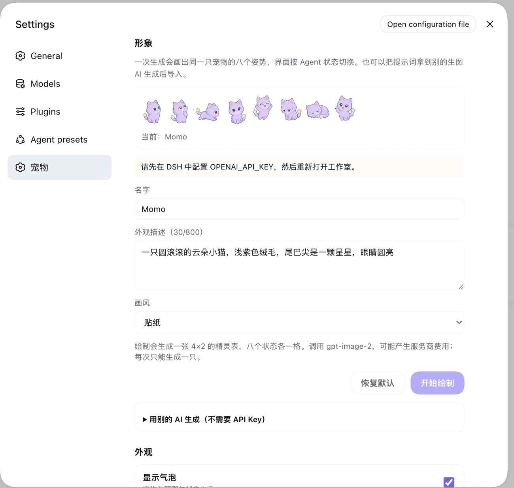

<p align="center">
  
</p>

<h1 align="center">DSH Agent Pet</h1>

<p align="center">
  <strong>A pet that lives in the corner of the DeepSeek Harness Web UI and changes pose with your agent.</strong>
</p>

<p align="center">
  It raises a paw while the agent thinks, runs while a tool executes, and sits up looking at you when it needs approval.<br>
  Generate its look from one sentence — with your own API key, or by taking the prompt to any other image AI.
</p>

<p align="center">
  <a href="LICENSE"></a>
  
  
  
</p>

<p align="center">
  <a href="README.md">中文</a> · English
</p>

<p align="center">
  
</p>

---

## One pose per state

Most desktop pets are a single image faking motion with transforms. This one is not: **a single generation draws eight poses of the same pet**, and the UI switches to the matching cell as the agent's state changes.

| State | Pose | When |
| --- | --- | --- |
| `idle` | standing, three-quarter view | nothing running |
| `thinking` | paw at chin, looking up | the agent is thinking |
| `running_tool` | running in profile | a tool is executing |
| `waiting_approval` | sitting up, looking at you | waiting for your confirmation |
| `done` | jumping, paws raised | finished |
| `error` | head down, shoulders slumped | something failed |
| `resting` | curled up asleep | reserved |
| `greeting` | waving a paw | reserved |

All eight come from **one generation**, so it is one character. Generating eight times separately yields eight similar-but-different animals — text-to-image has no memory, and character consistency is the whole difficulty here.

The last two poses have no trigger yet; reserving the cells now means adding states later will not require regenerating artwork.

---

## Three ways to get a pet

### 1. Do nothing

The packaged cloud cat Momo ships with the plugin and animates across all six states. It is a hand-written SVG: no API key, no network.

### 2. Draw one with your own API key


Open **Settings → 宠物**, or hover the pet and click 🎨. Enter a name, a description (8–800 characters), pick a style, and press "开始绘制".

The plugin generates a transparent 4×2 sprite sheet and swaps it in immediately. "恢复默认" restores Momo.

Style presets: `auto`, `pixel`, `sticker`, `plush`, `flat-vector`, `3d-toy`.

Drawing needs an image API key, resolved from the DSH credential service as `OPENAI_API_KEY` by default. Without one the studio says so and sends nothing.

<br clear="right">

### 3. Draw it in another AI and import it (no API key)


Expand "用别的 AI 生成" and press "生成提示词" for a **self-contained** prompt.

Paste it into any image AI, ask for a transparent 4×2 sprite sheet, then press "导入精灵表 PNG" and pick the file.

If that AI lays poses out differently, change the column/row inputs; `1×1` imports a single frame. The image dimensions must divide evenly by the grid.

This path needs no credential and costs nothing.

<br clear="right">

---

## Settings

<p align="center">
  
</p>

Installing adds a **宠物** section to Settings: the full studio on top, appearance switches below — bubble, animation, hide, and reset position.

Position, hidden state, and those switches are stored on the host, so they **survive reloads and restarts**.

---

## Install

Requires the DSH `web` profile.

```bash
dsh plugin --profile web add dsh-agent-pet
```

From Git:

```bash
dsh plugin --profile web add github:Noah-wang/dsh-agent-pet
```

From a local checkout:

```bash
dsh plugin --profile web add /absolute/path/to/dsh-agent-pet
```

Restart the DSH Web UI afterwards. To uninstall:

```bash
dsh plugin --profile web remove dsh-agent-pet
```

---

## Configuration

Override in your profile's patch layer. Everything is optional.

| Key | Default | Meaning |
| --- | --- | --- |
| `apiKeyEnv` | `OPENAI_API_KEY` | credential reference name |
| `model` | `gpt-image-2` | image model |
| `baseURL` | `https://api.openai.com/v1` | image endpoint; any OpenAI-compatible one works |
| `quality` | `medium` | `low` / `medium` / `high` |
| `dataDir` | `<DSH_HOME>/agent-pet` | where generated pets are stored |
| `petFile` | packaged `pets/default/pet.md` | custom pet definition |
| `idleAfterMs` | `2400` | milliseconds before returning to idle |

---

## Privacy

**The plugin does not read conversation text, tool arguments, tool results, API keys, or any credential.** It observes agent lifecycle events and tool names only.

The browser half makes same-origin requests to the local DSH host and nothing else. During generation the key is resolved inside the host process by the DSH credential service; it never reaches browser state, API responses, logs, or exported pet metadata.

Only bytes carrying a valid PNG signature are stored; generated SVG or HTML is rejected rather than executed. Full boundaries in [`SECURITY.md`](SECURITY.md).

---

## Interaction and customization

- Drag to move; × hides it into a 🐾 button that brings it back. Both are remembered across reloads
- Honors `prefers-reduced-motion` by disabling every animation
- Edit `pets/default/pet.md` to change the name, artwork, and the short line shown per state. `avatar` accepts only a relative path beside `pet.md`; the Markdown never executes scripts, commands, or HTML

Drive states locally while developing:

```bash
curl -X POST http://127.0.0.1:3080/api/agent-pet \
  -H 'content-type: application/json' \
  -d '{"state":"running_tool"}'
```

---

## Implementation notes

- **Zero runtime dependencies**; React is a peer dependency
- Sprite cells are selected with CSS `background-position`, so **neither side decodes an image**
- Single-frame pets (packaged Momo, older data, a user-uploaded single image) use `background-size: contain` and stay undistorted
- Generated artwork is written atomically and survives restarts

---

## Scope

`0.4.0`. Sprite-sheet generation, prompt export, external sheet import, a Settings section with durable preferences, and npm, Git, or local installation are supported.

Frame-by-frame animation, community account submission, cloud sync, ESP32 communication, and executable third-party pet plugins are not.

---

## License

[MIT](LICENSE)
