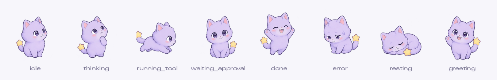
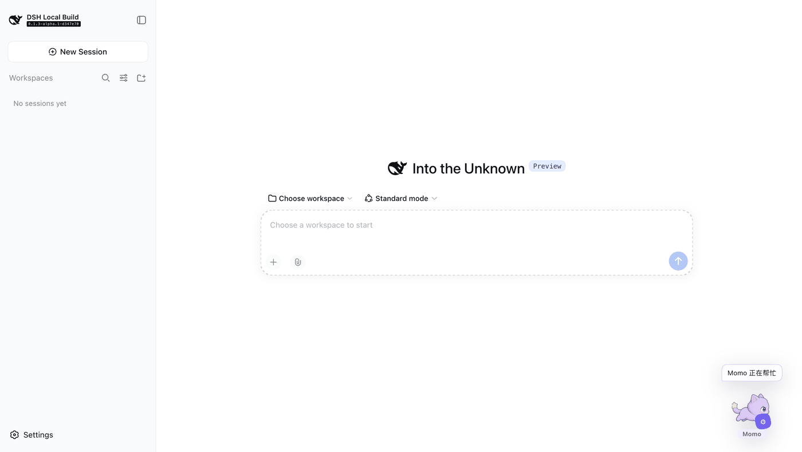
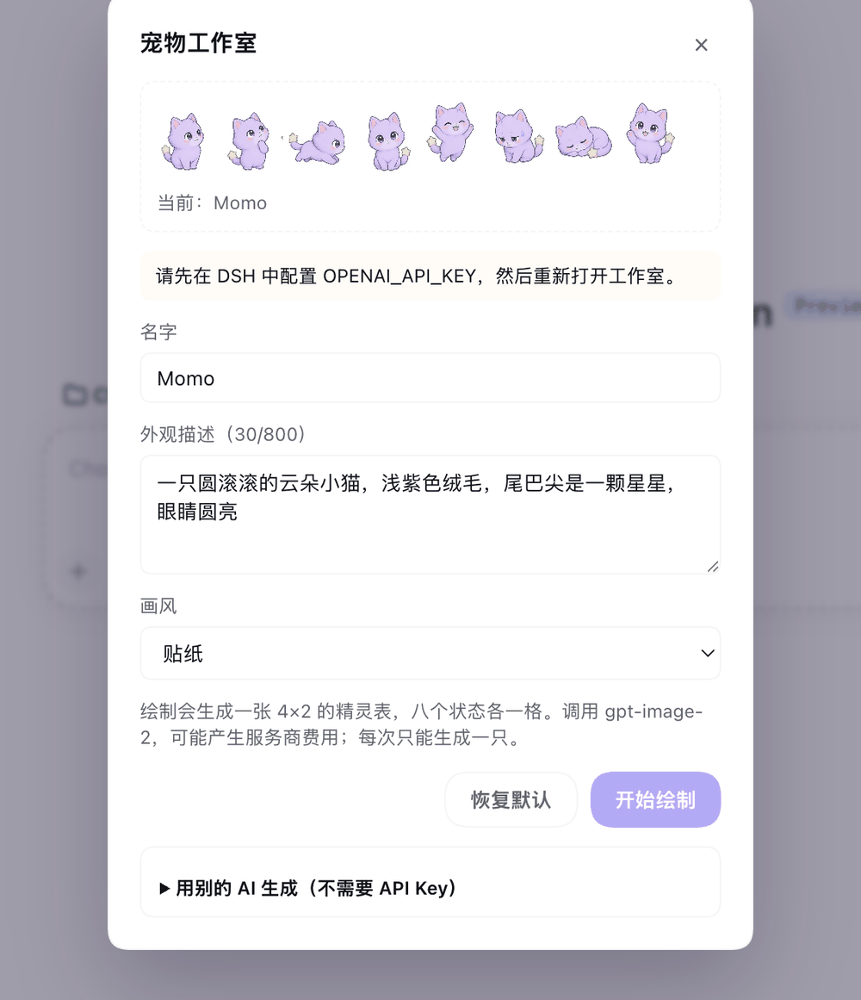
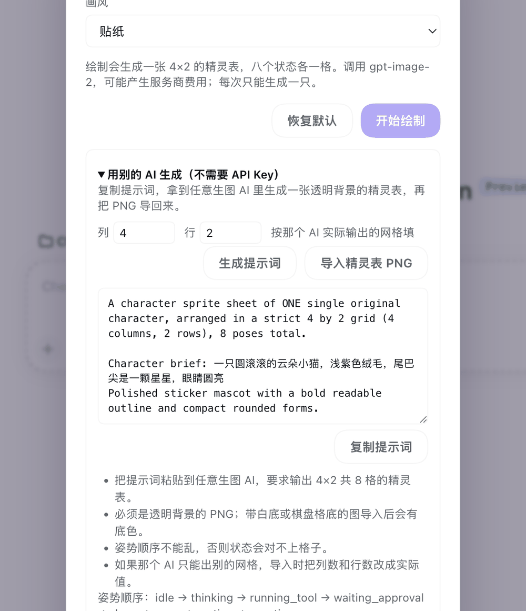

<p align="center">
  
</p>

<h1 align="center">DSH Agent Pet</h1>

<p align="center">
  <strong>一只住在 DeepSeek Harness Web UI 角落的宠物，跟着 Agent 换动作。</strong>
</p>

<p align="center">
  它思考的时候宠物抬爪，跑工具的时候宠物在跑，等你确认的时候宠物坐直了看着你。<br>
  形象可以用一句话描述生成——用你自己的 API Key，或者拿提示词去任何生图 AI。
</p>

<p align="center">
  <a href="LICENSE"></a>
  
  
  
</p>

<p align="center">
  中文 · <a href="README.en.md">English</a>
</p>

<p align="center">
  
</p>

---

## 每个状态一个动作

大多数桌宠只有一张图，靠位移和缩放假装在动。这个插件不是——**一次生成会画出同一只宠物的八个姿势**，界面按 Agent 当前状态切换到对应那格。

| 状态 | 动作 | 触发时机 |
| --- | --- | --- |
| `idle` | 侧身站着 | 没事做 |
| `thinking` | 抬爪仰头 | Agent 在思考 |
| `running_tool` | 侧面奔跑 | 正在执行工具 |
| `waiting_approval` | 端坐直视你 | 等你确认 |
| `done` | 举爪欢呼 | 完成 |
| `error` | 低头垂肩 | 出错 |
| `resting` | 蜷着睡 | 预留 |
| `greeting` | 挥爪 | 预留 |

八格来自**同一次生成**，所以是同一只宠物。分开生成八次只会得到八只长得像但不一样的动物——文生图没有记忆，角色一致性是这件事唯一的难点。

后两格暂时没有触发来源，先占好位置，以后加状态不用重新生成形象。

---

## 三种拥有一只宠物的方式

### 1. 什么都不做

装完就有一只内置的云朵猫 Momo，六个状态都能动。它是一张手写的 SVG，不需要任何 API Key、不联网。

### 2. 用自己的 API Key 画一只



把鼠标移到宠物上，点左上角的 🎨 打开工作室。填名字、外观描述（8–800 字符）、选画风，点「开始绘制」。

插件会生成一张 4×2 的透明精灵表并立刻替换当前形象。点「恢复默认」随时回到 Momo。

画风预设：`auto`、`pixel`、`sticker`、`plush`、`flat-vector`、`3d-toy`。

绘制需要图片服务的 Key，默认从 DSH 凭据服务读 `OPENAI_API_KEY`。没配置时工作室会直接告诉你，不会发请求。

<br clear="right">

### 3. 用别的 AI 画，再导进来（不需要 API Key）



展开「用别的 AI 生成」，点「生成提示词」，会给你一段**自包含**的提示词。

复制到任何生图 AI——即梦、Midjourney、Nano Banana 都行——让它输出一张透明背景的 4×2 精灵表，再点「导入精灵表 PNG」选中那张图。

如果那个 AI 只能出别的网格，把「列 / 行」改成实际值；填 `1×1` 就是单张图。图片尺寸必须能被网格整除。

这条路不需要任何 Key，也不产生费用。

<br clear="right">

---

## 安装

需要 DSH 的 `web` profile。

```bash
dsh plugin --profile web add dsh-agent-pet
```

从 Git 安装：

```bash
dsh plugin --profile web add github:Noah-wang/dsh-agent-pet
```

本地开发：

```bash
dsh plugin --profile web add /absolute/path/to/dsh-agent-pet
```

装好后重启 DSH Web UI。卸载：

```bash
dsh plugin --profile web remove dsh-agent-pet
```

---

## 配置

在 profile 的 patch 层覆盖，全部可选：

| 配置项 | 默认值 | 说明 |
| --- | --- | --- |
| `apiKeyEnv` | `OPENAI_API_KEY` | 凭据引用名 |
| `model` | `gpt-image-2` | 图片模型 |
| `baseURL` | `https://api.openai.com/v1` | 图片服务地址，兼容 OpenAI 协议的端点都行 |
| `quality` | `medium` | `low` / `medium` / `high` |
| `dataDir` | `<DSH_HOME>/agent-pet` | 生成结果存放目录 |
| `petFile` | 内置 `pets/default/pet.md` | 自定义宠物定义 |
| `idleAfterMs` | `2400` | 完成/出错后回到待命的毫秒数 |

---

## 隐私

**插件不读取对话正文、工具参数、工具结果、API Key 或任何凭据。** 它只观察 Agent 生命周期事件和工具名称。

浏览器端只请求 DSH 本机同源接口，不访问第三方。绘制时 Key 由 DSH 凭据服务在 Host 进程内解析，不会进入浏览器状态、API 响应、日志或导出的宠物元数据。

只接受签名合法的 PNG，生成的 SVG/HTML 会被拒绝而不是执行。完整边界见 [`SECURITY.md`](SECURITY.md)。

---

## 自定义与交互

- 拖拽移动，右上角 × 隐藏，变成 🐾 圆钮点回来
- 尊重 `prefers-reduced-motion`，开了就全部静止
- 编辑 `pets/default/pet.md` 可以改名字、形象和每个状态的短文案。`avatar` 只接受 `pet.md` 同目录下的相对路径；Markdown 不会执行脚本、命令或 HTML

本地切状态调试：

```bash
curl -X POST http://127.0.0.1:3080/api/agent-pet \
  -H 'content-type: application/json' \
  -d '{"state":"running_tool"}'
```

---

## 实现说明

- **零运行时依赖**，只有 React 的 peer dependency
- 精灵表用 CSS `background-position` 取格，**两端都不解码图片**
- 单帧形象（内置 Momo、旧数据、用户上传的单图）走 `background-size: contain`，不变形
- 生成结果原子落盘，重启后保留

---

## 当前范围

`0.3.0`。已支持精灵表生成、提示词导出、外部精灵表导入、本地或 Git 安装。

暂不包含逐帧动画、社区账号提交、云同步、ESP32 通信或可执行的第三方宠物插件。

---

## 许可证

[MIT](LICENSE)
